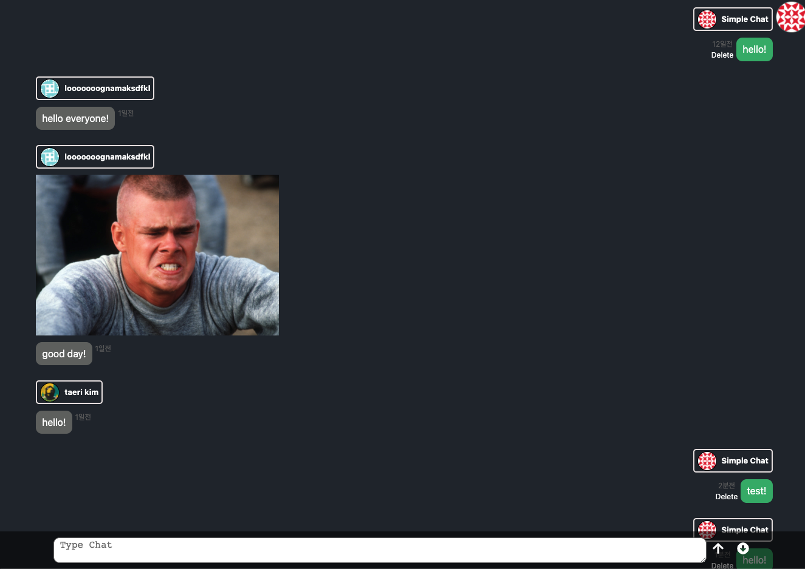
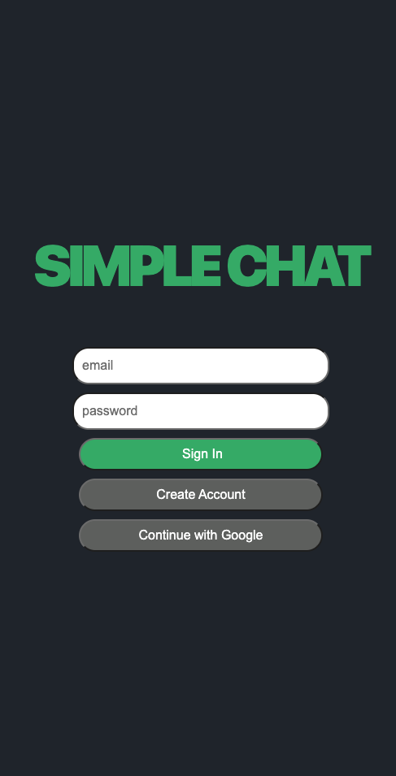
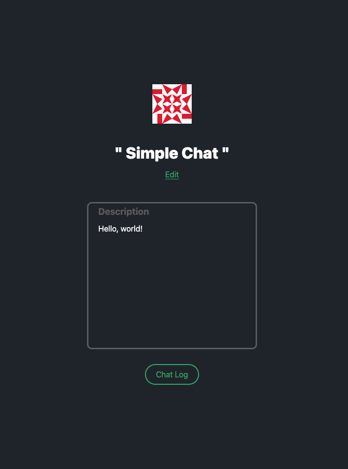

# Simple Chat App

real-time chat application with React, [Firebase](https://firebase.google.com/firebase)




## Feature

- Create Account with Email, Password
- Google OAuth login
- Real time chatting + send image
- Edit user's profile

## To use this app

1. make `.env` inside **root**

2. put firebase config into `.env`

```
    REACT_APP_API_KEY=
    REACT_APP_AUTH_DOMAIN=
    REACT_APP_PROJECT_ID=
    REACT_APP_STORAGE_BUCKET=
    REACT_APP_MESSAGIN_ID=
    REACT_APP_APP_ID=
```

3. Type " npm install " inside the root

if you want to use Google or Github OAuth 2.0 check [this](https://firebase.google.com/docs/auth)
